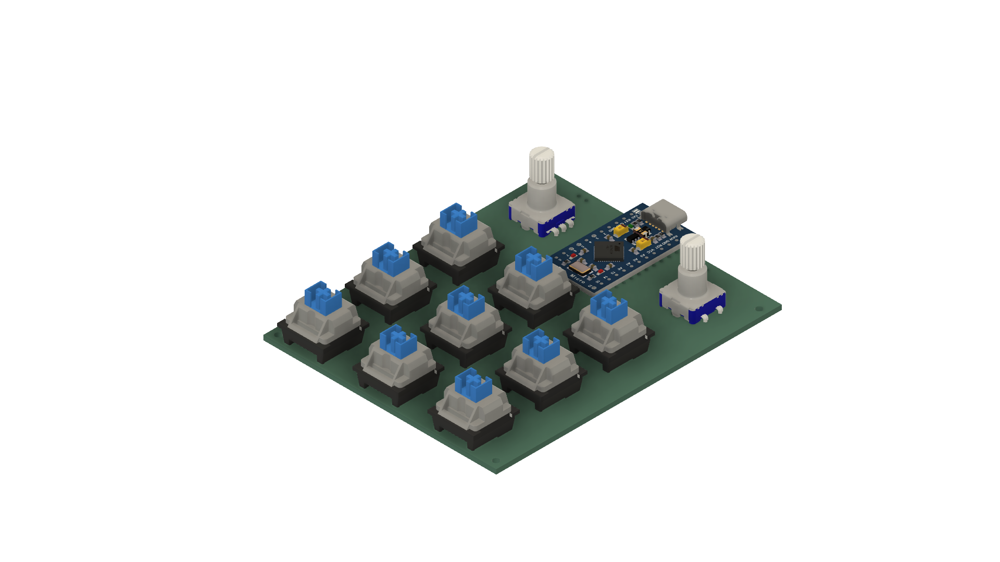
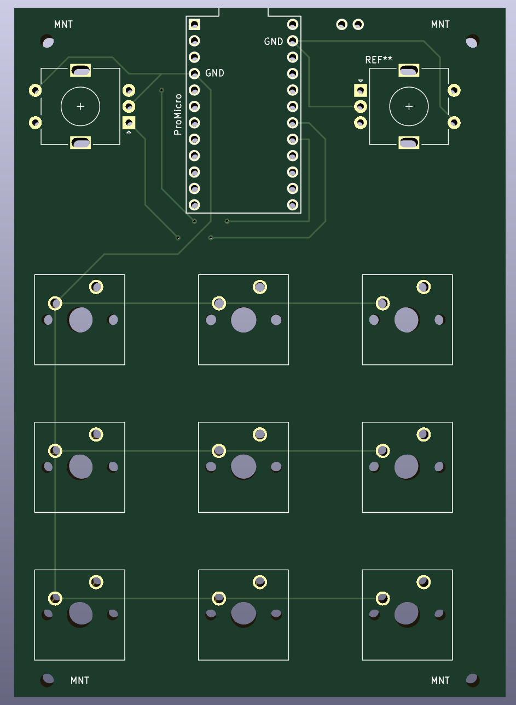
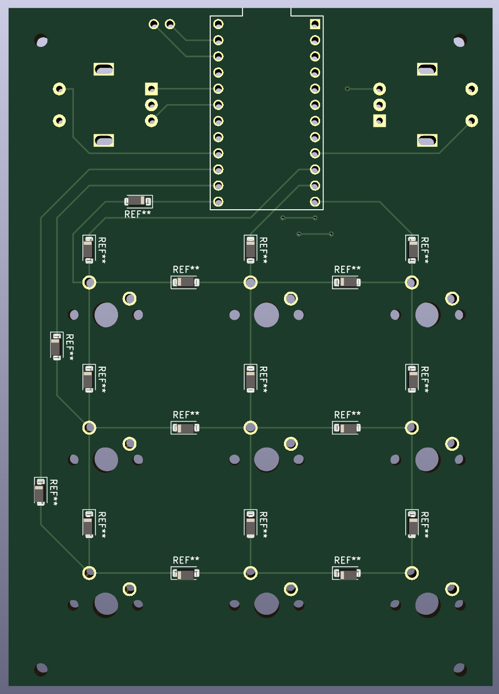
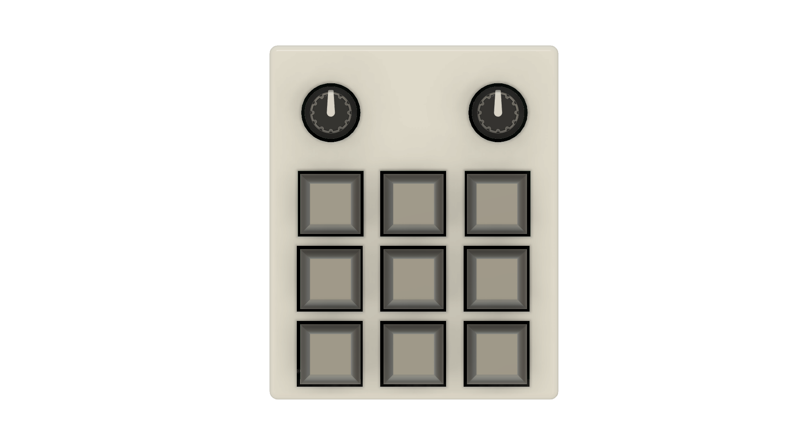

<h1>MacroPad</h1>

        <a href="https://github.com/robinaerts/macropad/issues">Report Bug</a>
    ·
    <a href="https://github.com/robinaerts/macropad/issues">Request Feature</a>
  

 

<!-- ABOUT THE PROJECT -->

## About The Project

An easy to customize macropad with 9 keys and two rotary encoders. Program the macros to do anything you want on your PC.

(<a href="#top">back to top</a>)

### Built With

 

Fusion360

### Hardware used:

- 2 Rotary encoders
- 9 MX cherry switches
- Arduino Pro Micro

(<a href="#top">back to top</a>)

<!-- GETTING STARTED -->

## Getting Started

Just plug in the device into your device, and it should be ready to go.

### Customization

Everything you need to build this yourself, is here ordered in the following file hierarchy.

- <strong>PCB Design (KiCad):</strong> /PCB
- <strong>3D Case Design (Fusion):</strong> /case
- <strong>Firmware:</strong> /code

## PCB

## CASE

3D case and keycaps designed in Fusion360.

## FIRMWARE

The firmware currently is all written in one .ino file. It uses the HID-project library to make the Arduino Pro Micro act as an HID device.

To edit the macros, just edit this file and flash it back on the pro micro. With more complex mappings, it might be easier to integrate AutoHotkey in the future.

(<a href="#top">back to top</a>)

<!-- LICENSE -->

## License

Distributed under the MIT License.

(<a href="#top">back to top</a>)

<!-- CONTACT -->

## Contact

Robin Aerts - nibor.aerts@gmail.com 
Website - [robinaerts.be](https://robinaerts.be)

(<a href="#top">back to top</a>)

[preview]: ./assets/images/banner.jpg
